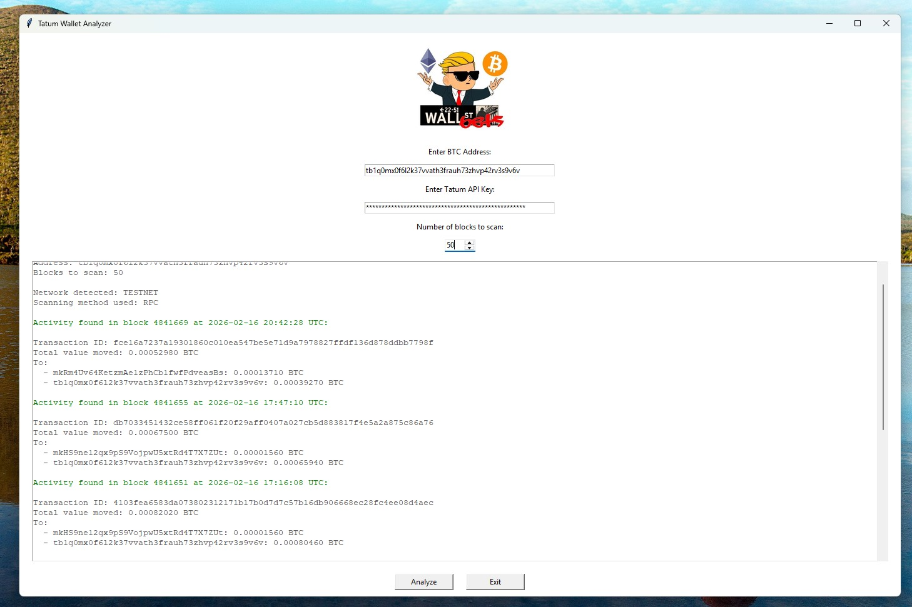

Tatum BTC Wallet Scanner
========================

A lightweight, real‑world example of how to use the Tatum Blockchain Data API
to monitor Bitcoin addresses, fetch their transactions, and analyze wallet
activity on both MAINNET and TESTNET.

This project demonstrates practical API usage, RPC scanning, and a simple
customer‑ready interface for blockchain monitoring.

----------------------------------------------------------------------
USE CASE
----------------------------------------------------------------------

Companies working with digital assets often need to:

- monitor incoming/outgoing BTC transactions
- track suspicious activity for AML/KYC purposes
- analyze wallet behavior
- build internal dashboards and alerts

This scanner provides a minimal, easy‑to‑extend foundation for such workflows.

----------------------------------------------------------------------
HOW IT WORKS
----------------------------------------------------------------------

1. User enters a BTC address, API key, and number of blocks to scan.
2. The scanner detects whether the address belongs to MAINNET or TESTNET.
3. It queries Tatum’s Blockchain Data API or RPC endpoint.
4. It retrieves and parses transactions.
5. Results are displayed in a clean, readable format.

Data Flow (simplified):

User Input → Network Detection → Tatum API/RPC → JSON Response → Parsed Output

----------------------------------------------------------------------
EXAMPLE SCREENSHOT
----------------------------------------------------------------------

### Testnet Scan


----------------------------------------------------------------------
FEATURES
----------------------------------------------------------------------

- Detects MAINNET vs TESTNET automatically
- Fetches latest BTC transactions
- Uses Tatum’s REST API or RPC
- Clean, readable output
- Simple GUI for user input
- Ready for extension (alerts, dashboards, storage, etc.)

----------------------------------------------------------------------
REQUIREMENTS
----------------------------------------------------------------------

- Python 3.10+
- Tatum API Key
- requests library
- tkinter (bundled with Python)

----------------------------------------------------------------------
INSTALLATION
----------------------------------------------------------------------

This project does not include a requirements.txt file.  
Install the required dependency manually:

    pip install requests

----------------------------------------------------------------------
CONFIGURATION
----------------------------------------------------------------------

This application does NOT require any system configuration.

The Tatum API key is entered directly in the GUI, so there is no need to set
environment variables.

Optional:
If you prefer to avoid typing the API key manually each time, you may store it
as an environment variable. The application will use it only if no key is
entered in the GUI.

macOS / Linux:
    export TATUM_API_KEY="your_api_key_here"

Windows PowerShell:
    setx TATUM_API_KEY "your_api_key_here"

----------------------------------------------------------------------
USAGE
----------------------------------------------------------------------

Run the scanner:

    python main.py

Enter:
- BTC address
- Tatum API key
- Number of blocks to scan

Then click "Analyze".

----------------------------------------------------------------------
PROJECT STRUCTURE
----------------------------------------------------------------------

```
tatum-btc-wallet-scanner/
│
├── main.py
├── src/
│   ├── app.py
│   ├── block_scanner_rest.py
│   ├── block_scanner_rpc.py
│   ├── gui.py
│   ├── network_utils.py
│   └── tatum_endpoints.py
│
├── assets/
│   ├── testnet_print_screen.jpg
│   ├── mainnet_print_screen_test.jpg
│   └── wsb.jpg
│
└── README.txt
```

----------------------------------------------------------------------
CODE OVERVIEW
----------------------------------------------------------------------

The core logic includes:

- Network detection (MAINNET vs TESTNET)
- RPC scanning for block activity
- REST API fallback
- Transaction parsing
- GUI wrapper for user-friendly interaction

----------------------------------------------------------------------
TESTING ADDRESSES
----------------------------------------------------------------------

Example BTC address:

    bc1qxy2kgdygjrsqtzq2n0yrf2493p83kkfjhx0wlh

----------------------------------------------------------------------
TROUBLESHOOTING
----------------------------------------------------------------------

"Invalid API key"
    Check that the key is entered correctly in the GUI.

"No activity found"
    The address may be inactive or the scanned block range is too small.

"RPC/REST request failed"
    Check:
    - internet connection
    - API key
    - Tatum service status

----------------------------------------------------------------------
POSSIBLE EXTENSIONS
----------------------------------------------------------------------

- Add alerts (email, Slack, webhook)
- Store transactions in a database
- Add pagination for large wallets
- Add support for multiple addresses
- Build a simple web dashboard
- Add risk scoring or AML heuristics

----------------------------------------------------------------------
LICENSE
----------------------------------------------------------------------

This project is provided without an open‑source license.
All rights reserved.
